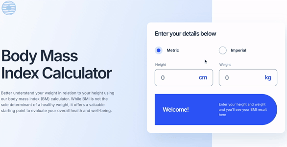

# Frontend Mentor - Body Mass Index Calculator solution

This is a solution to the [Body Mass Index Calculator challenge on Frontend Mentor](https://www.frontendmentor.io/challenges/body-mass-index-calculator-brrBkfSz1T). Frontend Mentor challenges help you improve your coding skills by building realistic projects.

## Table of contents

-   [Overview](#overview)
    -   [The challenge](#the-challenge)
    -   [Screenshot](#screenshot)
    -   [Links](#links)
-   [My process](#my-process)
    -   [Built with](#built-with)
    -   [What I learned](#what-i-learned)
    -   [Continued development](#continued-development)
-   [Author](#author)

## Overview

### The challenge

Users should be able to:

-   Select whether they want to use metric or imperial units
-   Enter their height and weight
-   See their BMI result, with their weight classification and healthy weight range
-   View the optimal layout for the interface depending on their device's screen size
-   See hover and focus states for all interactive elements on the page

### Screenshot

### Links

-   [Solution URL](https://www.frontendmentor.io/solutions/body-mass-index-calculator-built-with-react-nextjs-and-vitest-wC1N8Jkvf4)

-   [Live Site](https://gdsimoes-bmi-calculator.vercel.app/)

## My process

### Built with

-   [React](https://reactjs.org/) - JS library
-   [Next.js](https://nextjs.org/) - React framework
-   [Vitest](https://vitest.dev/) - Testing framework

### What I learned

This project was my first on Frontend Mentor using Next.js and Vitest, marking a return to building projects from scratch with these technologies. It was a rich learning experience, allowing me to refresh my skills and tackle new challenges. I practiced using server components and created a VisuallyHidden component, heavily inspired by this [Josh Comeau's article](https://www.joshwcomeau.com/snippets/react-components/visually-hidden/). I also faced some CSS challenges:

-   I discovered the [`row-gap`](https://developer.mozilla.org/en-US/docs/Web/CSS/row-gap) property, which greatly simplified the CSS.

-   I learned techniques for hiding the input element’s spin button, with [this StackOverflow answer](https://stackoverflow.com/questions/3790935/can-i-hide-the-html5-number-input-s-spin-box) providing valuable insights.

-   I applied several CSS tricks to style the radio buttons just right, guided by [this article by Stephanie Eckles](https://moderncss.dev/pure-css-custom-styled-radio-buttons/), which helped me refine my approach.

This experience deepened my understanding of both Next.js and CSS, reinforcing my problem-solving skills and attention to detail.

### Continued development

In my upcoming projects, I plan to further enhance my skills in accessibility and testing with Vitest. I also aim to take on more complex full stack projects to deepen my expertise in both front-end and back-end development.

## Author

-   Website - <https://gdsimoes.com>
-   Frontend Mentor - [gdsimoes](https://www.frontendmentor.io/profile/gdsimoes)
-   LinkedIn - [gdsimoes](https://www.linkedin.com/in/gdsimoes)
